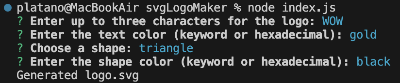
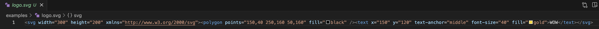

# SVG Logo Maker


## Description

A Node.js command-line application that takes in user input to generate a logo and save it as an [SVG file](https://en.wikipedia.org/wiki/Scalable_Vector_Graphics). The application prompts the user to select a color and shape, provide text for the logo, and save the generated SVG to a `.svg` file.

## Table of Contents
- [Installation](#installation)
- [Usage](#usage)
- [License](#license)
- [Contributing](#contributing)
- [Tests](#tests)
- [Questions](#questions)

## Installation
You will need node and to install the dependenant npms. In your terminal run npm i inquirer@8.2.4. Then run npm i fs. Then run npm install --save-dev jest

## Usage
The application will be invoked by using the following command:

```bash
node index.js
```





[Video Link Demonstration](https://drive.google.com/file/d/1FKmfBCKOmfdx03EdSIfeW7HjqsMOv01v/view)

## License
This project is licensed under the MIT License.

## Contributing

## Tests
To run tests included. Have all necesarry npms installed. Run npm test in your console.

## Questions
For questions, please contact 
- GitHub: [platano91](https://github.com/platano91)
- Email: 

